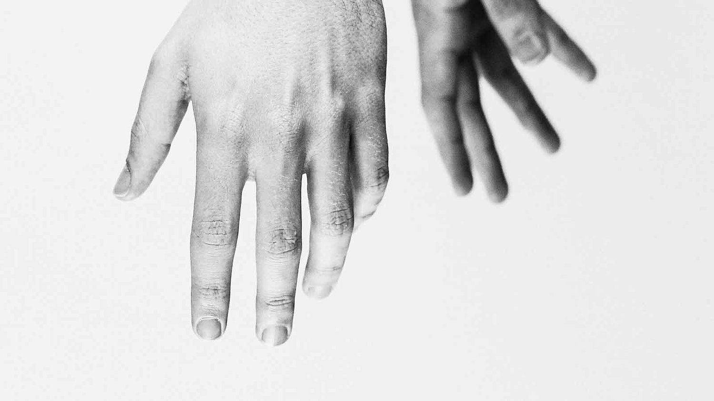

Each morning I wake up and slowly stumble downstairs to let my dog out. On the way I typically call out to Alexa and tell her to turn on the news. After a few seconds, my TV powers up and automatically turns to the preprogrammed channel.

A couple of thoughts pass through my head each time I do this. First, I think about how lazy I must be that I don’t want to take the effort to simply walk over to the table and use the remote control. But, I also think about how wonderful, and effective, it is for me to be able to complete this task while performing a completely separate and unrelated task.

In a way, this is the beauty of contactless biometrics. A task can be successfully completed without physical user engagement.

Here are 6 particular reasons why contactless biometrics are #winning today.

## 1. Less friction

There is a term in the biometrics industry that loosely describes the usability of a system. That term is “friction”. This refers to the amount of effort required by the subject of the system to perform the particular biometric operation. Typically the more friction, the lower the user acceptance.

For example, having to use ink and cards for tenprint fingerprint collection in the past was full of friction. Thankfully industry removed a bit of friction by removing the ink and optically capturing images placed on a glass platen. Now, industry is taking it even further and introducing contactless fingerprint collection. What use to take a subject having their hand pressed onto ink and physically rolled across paper can now be done while walking and simply moving your hand through a sensor capture area.

## 2. Less intrusive

Contactless biometrics are less intrusive than traditional biometrics requiring physical touch. Just as it’s less intrusive for me to bark out a command to Alexa rather than having to physically press buttons on a remote.

However, the level of intrusiveness varies by contactless biometric modality. Some are less intrusive than others. For instance, face biometric systems are typically the least intrusive. They can passively scan a collection area and surreptitiously scoop up face images with limited to no user interaction. On the other hand (no pun intended), contactless fingerprint collection requires more subject discipline while interacting with the system.

While there are significant benefits of having a non-intrusive biometric system, there are issues and risks that need to be considered before implementation. What are the privacy concerns with collecting in this manner? Will the system performance be negatively impacted by the lack of subject compliance and interaction with sensors? Will subjects know how to “use” the system?

## 3. Less health concerns

People get freaked out when having to touch devices other people have touched. While this is understandable, it’s also a bit of an overreaction. After all, those same people just touched the doorknob, the grocery cart, the gas pump...you get the idea.

Having the ability to collect biometric samples without the subject physically touching a device does increase user acceptance. The perception of a more sterile interaction by not touching a “dirty” device typically helps address any level of apprehension new users may have. This is especially the case with fingerprint biometrics. In high volume areas, glass platens can get rather dirty and nasty.

This has also been the case with eye-based biometrics. In the past, subjects would have to place their forehead up to a device and look into a cup for their retina to be captured. Placing your eye into a cup presents the perception that bad things are happening to your eye. The move away from retina and toward iris has allowed collection at a distance and a more pleasant experience for the end user.

## 4. Less maintenance

Removing the physical contact with devices also reduces the amount of maintenance required. Perhaps the biggest impact is seen with contactless fingerprint. As mentioned earlier, glass platens can take a beating over time. As a result they require ongoing cleaning and replacement of protective silicon pads or possibly even the entire device.

Contactless technology allows longer run times with less cleaning and fewer consumables necessary to support ongoing system availability.

## 5. More speed

This one is pretty straight forward. The mere fact you can collect biometrics somewhat passively, as a subject is moving, should speed things up.

Unfortunately, this is not always a given. For instance, if subjects have no idea how to present their hand to a contactless fingerprint device, it may actually cause a bottleneck in your process.

However, with solid system design, intuitive UI/UX, and human engineering contactless biometrics can provide optimal throughput while adding the intended beneficial layer of extra security.

## 6. More cool

Finally, contactless biometrics just have a cool factor about them. Having the ability to receive a system benefit simply by walking through a capture zone and having your biometric collected with limited engagement, is pretty cool. The novelty of contactless capture is the key factor driving substantial increases in user acceptance and wider spread adoption.

Placing your hand on glass platen for fingerprint collection unfortunately makes people think of the criminal booking process. Waving your hand over a device or passing it through a sensor as you walk feels cutting edge. Apple made it cool to use your fingerprint on your phone. Google is making it cool to differentiate voices in your family when using home automation. Snapchat made it cool by adding filters to your face. Samsung made it cool to have your iris scanned.

## In summary

Contactless technology is providing new and innovative ways for systems to leverage the power of biometrics. Industry will continue to press the limits and advancements will abound.

The distance to capture will extend. The quality of sample images collected will be enhanced. The flexibility of the system to accommodate variance in presentation from the subject will improve.

These advancements, along with the inherent benefits outlined above, will drive widespread biometric adoption and ultimately weave the technology into our daily social fabric. And maybe even let me turn on my TV simply by seeing me walk by.
