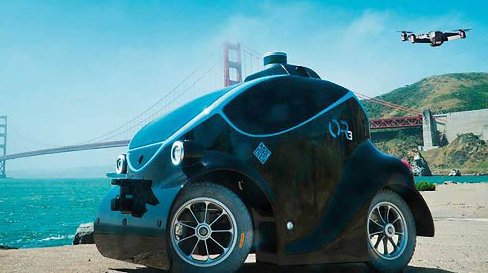

I typically spend some time scanning various websites and online resources for the latest implementations of emerging technology and the innovative ways in which it is used. The other day I came across a story that caught my attention. It was one of those articles that really makes you say, “hmmm”.

On Tuesday, Dubai Police officially introduced autonomous self-driving mini police cars. This news comes approximately a month after they let everyone know they’d be deploying a flying taxi service, so you know they already live on the bleeding edge.

Sure, a story about an autonomous self-driving mini police car would be pretty cool on it’s own, but understanding the full capabilities of it is where it becomes really interesting. On top of all of the amazing technology to make the car maneuver through the streets unimpeded, they have also added biometric software to identify potential suspects within view.

In other words, they are introducing a robot in vehicle form that will drive around scanning everyone it encounters to determine if they are a “bad guy”. Interesting to say the least.

Let’s dig into some of the good things and some of the not so good things with this particular solution.

# The potential benefits of a solution like this

## Mobilizing Surveillance

In the past if you wanted to surveil an area you would deploy a multitude of cameras on poles. These cameras could employ Pan, Tilt, Zone (PTZ) capabilities but for all intents and purposes, they were fixed in place and somewhat limited in their functionality.

With this new device you have a solution that is bringing the surveillance mechanism down from the poles and mobilizing it. Your surveillance perimeter is now dynamic and you are able to flex your coverage to particular areas of interest.

## Force Multiplier

By employing the use of the machine, humans can turn attention to more important tasks. At least that’s the idea, right? Introduce robots to handle some of the rudimentary and repetitive tasks so humans can move on to bigger and better things.

The use of robots in this capacity definitely serves as a force multiplier by providing ongoing threat analysis without continuous human oversight.

# What could possibly go wrong with a solution like this?

## Form Factor Issues

If you watch the video you’ll see a slow moving overgrown toy car meandering through the city streets. I’m not sure this police unit will be the most adept at catching shifty criminals. In fact, what if you sneak up from the back and just knock it over like a turtle?

If you’ve ever played with an Radio Control (RC) car you know the feeling. You spend half of your time playing with it by flipping it rightside up so it can drive again. This cute little police car could get flipped over by the bad guys and require other police officers to respond to the scene just to place it upright again.

Perhaps they’ve thought about this and have defensive measures employed, but that’s one of my first thoughts.

## Public Unease

I’m pretty sure most people would feel a bit uneasy if this R2D2 Robocop rolled by them. You have to admit there is a creepy factor to it moving along silently scanning everything in sight, including you. Plus, there’s something strange about the size. It’s big enough that you won’t miss it, but also small enough to really make you wonder what’s going on.

## Privacy Concerns

The privacy folks in the United States would have a field day with this one. This has Big Brother written all over it and I’m sure there would be extensive public outcry if these robots hit the streets in the U.S.

Sure, there are surveillance cameras deployed everywhere today and your expectations regarding privacy related to your face in public is pretty limited. But this just seems to elevate the game to a degree which would roil the privacy groups to a whole other level.

## Facial Technology Limitations

Face biometrics can work well when deployed in proper environments with adequate controls. When deployed in the wild, in a non-ideal environment with indifferent or uncooperative users, the accuracy rates can plummet.

Is this really the technology you want to use to passively scan an uncooperative population to determine whether they should be detained or not? The number of false matches would require extensive operational response and may actually waste valuable time you were trying to save with the introduction of the technology in the first place. Beyond that, I’m pretty sure the bad guys will quickly look away or even worse, run away. Which leads me to the next point.

## Pursuit Limitations

In the video you can see that the car is not going to pursue someone who is running away. It’s just too slow. That’s when it deploys the drone. Yes, the drone drawer in the back of the car.

Let’s say someone starts to run away. Let’s say the drone is deployed somewhat quickly. Then what? How does the drone know who to follow? In the video it makes it seem pretty straightforward but what if the person is in a crowd. I’m assuming the release of the drone utilizes a human operator in the backend who then steers the drone to follow the suspect. Again, I’m assuming they’ve thought of all of this.

## Cost and O&M

I have to imagine these self-driving mini cars cost quite a bit of money. It has to be much more than the cost of a series of PTZ cameras deployed. So, is the cost worth the benefit? I’m not so sure. Bottomline, I think Dubai has a lot of money and are looking for cool ways to spend it. Good for them.

# In Summary

These sorts of stories should really make you think about the future. With the advances in artificial intelligence, deep learning, and robotics your daily experiences will soon be much different than they have been in the past.

Human-machine interaction will become commonplace. Today we have self-driving cars and equally disruptive devices like Amazon Echo and Google Home. Tomorrow we will have autonomous trucks and vehicles driving about moving freight and passengers. Robots will be rolling through the airport providing customer service. Devices will be communicating with each other and learning to adapt to their environment.

While there are benefits to mini police cars driving around the city, it also serves as another reminder that each day of innovative advancement moves us one step closer to technological singularity. Even if you don’t fully recognize or want to believe the future holds such a profound difference in human civilization, this should at least make you take a moment to think and say, “hmmm”.
