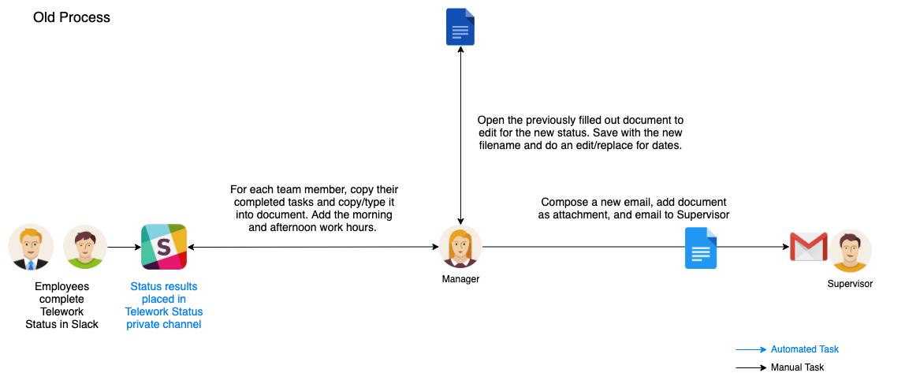
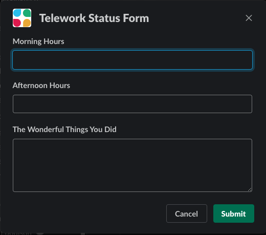
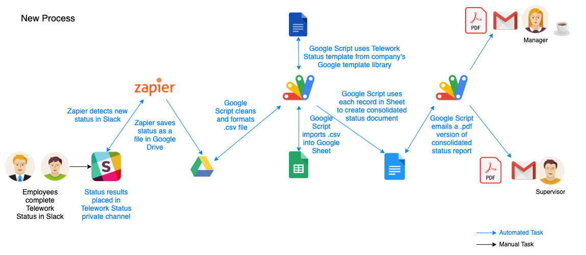

Teleworking with my current client requires the submission of a form at the end of each day. This form includes hours worked as well as the particular tasks that were worked during that day. Each contractor needs to provide this data, typically organized by their direct manager and emailed to the Supervisor.

This form was only supposed to be used on the rare occasion you had to work from home. Most of the time you were in the office or at the client's work location. With the onset and persistence of COVID-19 and working from home, this form became a daily headache.

## The old process

Here is a diagram of the high level process to provide the telework form to the Supervisor.

This diagram shows my team's early pandemic process with some automation already implemented. Other teams, and the standard process, require employees to open a Word document, fill out the telework form, and send it to their manager for submission to the Supervisor.

Since I'm a nice guy, I decided early in the pandemic to save my developers' sanity and created a way to use Slack as the input mechanism for entering their daily status. Since they were already using Slack throughout the day, there was no need to have them go find and fill out a Word document separately. What developer wants to do that?

Slack makes this possible with [Workflows](https://slack.com/features/workflow-automation). I'm not going to cover that in depth here but workflows allow you to add a quick process in Slack where you can present someone with a dialog box for them to fill out some information and then have the workflow route the output accordingly.

Here is the Slack form the developers fill out every day on my team.

This is accessible from our main team Slack channel via a shortcut. Once they fill it out and click Submit, it dumps the output, in a semi-standardized format into a private telework channel.

This was the first step in what would ultimately become a fully automated workflow.

## Let's automate further

One of the joys of automation is that once you start, you just keep going until everything is running gloriously on its own. As you work through the process, you say, "hmmm, maybe I can make this happen". That evolves into, "well, since that happened, maybe I can make this happen too". Before you know it you have a fully automated process and you get to go play Fortnite.

### High level problem to solve

In the most simple terms, I needed to take input from all of the developers in Slack on one end, and spit out a fully filled in and consolidated Word document, based on the approved template, on the other end, oh, and then email it to the Supervisor.

The big problem - I was spending 30 minutes every night manually copy/pasting developer status from Slack to a Word document. This included typing in their work hours and each of their status items before writing and formatting an email to send to the Supervisor. Not fun.

### Tools

I like to use tools that cost as little as possible, with free being even better. With that in mind, and given the use case and integration needs, some of the typical tools were sort of ruled out, such as UiPath, Microsoft Flow, etc.

I also wanted to keep it as simple as possible. I could've built a Slack bot with a Netlify backend service and engineer the hell out of it, but why? Automation is about making your life easier, not adding unnecessary complexity.

So, I decided to lean on the following tools for this project:

- Slack
- Zapier
- Google Apps Script
- Google Drive
- Google Sheets
- Google Docs
- Gmail
- Coffee

## This is what it looks like now

The following diagram provides an overview of how the process has been fully automated with the various tools.

Playing the role of Manager in this scenario, I now do nothing. The developers enter their status in Slack and out the other end comes an email with all of their status items and hours worked. #winning

Here are the steps of the process within this new automated workflow.

1. At the end of the day, while the developer is in `Slack`, they launch the workflow from the team's private channel. They enter the wonderful things they did today and click `submit`.

2. The `Slack workflow` dumps the output from each developer into a private `Slack` `#telework-status` channel as a collection point. The output is structured as much as possible given the built-in capabilities of `Slack workflows` (which isn't much). I do format it as much as possible for processing later by the `Google Apps Script` though.

3. At the same time, `Zapier` has been configured to monitor that private `#telework-status` channel for any new messages. Once the developer's message shows up in the `Slack` channel, `Zapier` swoops in, grabs it, and saves it to a folder on my `Google Drive`. You don't have much control over the output of this process and unfortunately it saves it as a basic text (.txt) file.

4. Developers know to get their daily status in by 8pm because I have a `Google Apps Script` that is scheduled to run automatically between 8pm and 9pm Mon-Fri. When that script runs it goes to the `Google Drive` folder and reads each text file that was created from the `Slack workflow` and cleans it up. Cleaning it means creating a more formatted .csv file that can be imported into `Google Sheets` later. Developers can enter anything, in any way, during the input process so this step is needed to add some basic structure.

5. Next, the same `Google Apps Script` loops through each newly cleaned .csv file and imports all of them into a `Google Sheet`. This allows me to move from the unstructured developer data to structured data in `Google Sheets`, which makes it a whole lot easier to manage the automated process of populating the `Google Doc` later. After each .csv is processed it is renamed so that it is not processed again by the script.

6. Now that we have structured data in `Sheets`, the `Google Apps Script` then pulls the `Google Docs` template from the `Google Drive`. The script consumes the template, reading each section in order to write it out to a new document with all of the data populated. The script loops through each row of the `Sheet` (which is each developer's individual status), fills in the particular data elements on the form, and creates a new page in the `Google Doc` representing each developer.

7. This newly consolidated and fully filled out `Google Doc` is stored on the `Google Drive` and is ready to be sent to the Supervisor. In this particular case, it's a 7 page document with headers, tables, and multiple paragraphs with data that was collected originally in `Slack` now seamlessly embedded in the natural flow of the status report text.

8. I have another `Google Apps Script` that is triggered to run in the 9pm hour that will take the consolidated `Google Doc` file and email it to the Supervisor. I don't want to send a link to the `Google Drive`, or require the Supervisor to use `Google Docs` to read the status, so the script converts the file prior to emailing it. Google doesn't make it easy to convert to Microsoft Word (imagine that) so I went down the quicker path of converting it to a PDF. The script reads in the `Google Doc`, converts it, then forms an email (e.g. header, subject, body), and fires it to the Supervisor. It also cc's me so I can keep an eye on the process and conduct spot-checks.

9. The manager (me!) gets to go about their life and simply verify that the process ran by receiving that email every night.

10. A final `Google Apps Script` triggers in the 10pm hour to go out to the `Google Drive` to perform clean up so this process can repeat the next business day.

## The work involved

The cool thing was it didn't take long to implement this entire system. In fact, I researched, built, tested, and implemented the entire thing in one weekend. Many of these tools are self explantory and for the issues you might run into, there are many resources available online that you can lean on for help.

With anything, there are levels of "done". I could still go in and make it more flexible, more dynamic, and more resilient (e.g. handling holidays) but for now it gets the job done with minimal oversight and I'm good with that.

## The results

As you know, the pandemic made us start working from home heavily in mid to late March 2020. I dealt with the manual process of consolidating developer status in a Word document for a couple of months before I hit my breaking point and had to find a better way.

I officially launched this automation process on May 19, 2020. Here are some fun facts:

- **Launch:** 5/19/2020
- **Number of _business days_ since (at the time of this post):** 93
- **Number of minutes of manual work saved per day:** 30 mins
- **Total minutes saved:** 2,790 mins
- **Total hours saved:** 46.5 hours
- **Number of days of my life reclaimed:** almost 2 full days! (and counting)

It's more than just pure time saved too. It's also my sanity. Having to perform this nightly task was tedious, boring, and disheartening. I dreaded it. Now, I _still_ get a feeling of satisfaction when I get cc'd on an email to the Supervisor around 9:30pm every night with the team's status.

I'm always looking for new ways to automate tasks in my life, so this was a lot of fun. I continue to search for ways that automation can help me reclaim one of our most fleeting resources - time. To this end, I just recently used UiPath to build a couple of attended bots to process all of my team's AWS expense reports. Fantastic.

If you are interested in learning more or have any questions, feel free to reach out via email or find me on Twitter [@jeffdstephens](https://www.twitter.com/jeffdstephens).
