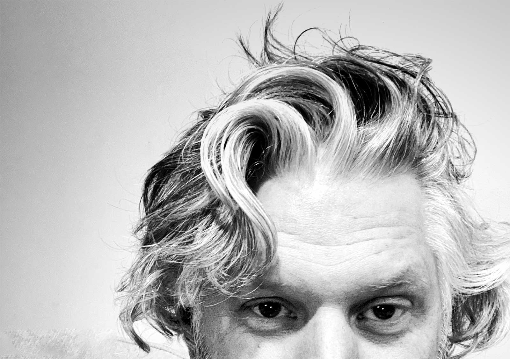

Over the last several years I've been a bit more diligent in documenting and measuring my annual goals, both personally and professionally. This allows me to establish a framework for the coming year while also providing me guidelines and reference points along the way.

## My method

To manage my goals for the year I typically create a note in Evernote with a name such as `2020 Goals`. Brilliant, right? I then refer to this note throughout the year, documenting accomplishments, adding new items, and providing clarifications as needed. At the end of the year I revisit the list to check my progress and use it as a feeder for the coming year's goals. This is a very rough and rudimentary method for managing goals, but it works for me for now.

Each year I also choose a word that will be used as my core guiding principle or theme for the year.

**2020 Word of the Year:** _Community_ (Yeah, not exactly a good word in retrospect)

## 2020, oh boy

2020 was a unique year in that its impacts were felt globally and its stench persisted for almost the entire year. It introduced a number of challenges in our lives and resulted in a complete disruption to how we live. Goals tended to fall by the wayside as folks generally just tried to survive day-by-day. In fact, 2020 aligns really well with one of my favorite quotes.

> "Everyone has a plan, until they get punched in the mouth." - Mike Tyson

There's no doubt 2020 punched us in the mouth...repeatedly. But, we kept rolling with the punches, adapting, and moving forward. I was extremely lucky this year in that I remained gainfully employed with a job that I enjoy and had limited personal exposure to the virus.

So, let's take a look back at how my 2020 played out.

## Professional areas

In 2020 I continued my role as the Chief Technology Officer (CTO) at <a href="https://www.dignari.com" target="_blank">Dignari</a>. We are a young company (founded in 2013) and as such most of my work for the last several years has been heavily focused on direct client delivery. As a result, I was limited in the amount of time I could dedicate to the growth of the company itself.

So, I made it a goal heading into 2020 that I would step back a bit from the day-to-day delivery of our emerging technology work and focus more on the company.

Here are a few results of my re-focused energy.

- **Internal hackathon** - I initiated, planned, and executed the company's first internal (virtual) hackathon. This multi-week event brought teams together across the company to identify and propose COVID related solutions that would be valuable to our clients.
- **CMMI-DEV Level 3 appraisal** - I led the effort to <a href="https://www.dignari.com/blog/dignari-cmmi" target="_blank">achieve a CMMI DEV Level 3 appraisal</a> on one of our emerging technology projects, demonstrating our robust and repeatable agile development methodology as well as our DevSecOps and Infrastructure-as-Code (IaC) approaches.
- **Launched Dignari.dev** - It had been a goal of mine for a number of years to establish a home for developers at Dignari and this year the catalyst to finally get that done was the CMMI-DEV appraisal process. I developed the site using Gatsbyjs and hosted it using our existing GitLab instance. This allows us to have an internal website for developers, built by developers, using tools and methods developer's enjoy. Gatsby is a static site generator so all content is managed via markdown files checked into our GitLab repo. When changes are commited and merged, GitLab's CI/CD process takes over and builds and deploys the site automatically across their Pages Content Delivery Network (CDN).
- **Dignari rebrand** - I worked extensively with our Human-Centered Design team and Dignari leadership to completely <a href="https://www.dignari.com/rebrand" target="_blank">redesign our website</a> and rebrand our message. I feel this really helped us clarify who we are, what we do, and where we want to go.
- **Bot development** - I spent some time this year on automation. I love automation. In particular, I automated tasks that helped our team <a href="https://www.jeffdstephens.com/posts/status-report-automation/" target="_blank">provide status during the pandemic</a> and also found ways to use UiPath Robotic Process Automation (RPA) to make my life a bit easier. I built attended bots that go out to all of our AWS instances and gather billing information and then automatically populate an aggregate expense report for submission. I also built business intelligence bots that scrape government sites for competitor intelligence and business opportunities. You can read more about how I <a href="https://www.jeffdstephens.com/posts/uipath-gitlab/" target="_blank">linked up our GitLab instance and UiPath</a> on this blog. This work was not only technically satisfying but it also saved me _considerable_ time which I could use elsewhere. I see a lot more bot development in the coming year.
- **Lunch and Learns** - I initiated recurring company Lunch and Learn meetings where Dignarians are able to showcase new technology or share their unique knowledge with others. Topics have included RPA, digital driver's licenses, the intelligence community, UI/UX case studies, and others. I'm a big believer in sharing knowledge with others so this is one I'm really happy with and look forward to continuing in the future.
- **UI/UX capability growth** - Our designers and UI/UX specialists are amazing. We want to continue to grow this part of the business and as a result we recently entered the Department of Homeland Security (DHS) Science and Technology (S&T) Trusted User Interface for Digital Wallets challenge. I worked with our creative director and one of our solution architects to create a modern design that fits the technical requirements that are emerging in the digital wallet space. Our solution was selected as one of the <a href="https://www.dhs.gov/science-and-technology/prize-competitions" target="_blank">three finalists</a> with the grand prize to be announced late January 2021.
- **Client delivery** - And I can't forget all of the work done to support our wonderful clients. This includes providing project oversight and technical guidance on the development of a full stack application that will streamline their business and provide a robust cloud-based solution for years to come. In addition, I provided research and analysis on a number of emerging technologies relevant to their mission space.

It's important to note that each of these items required dedicated support from a larger team and could not be done by me alone. I'm thankful for the people I work with and their desire to deliver value to our clients and to each other. While all of these accomplishments make me proud, there were other professional areas where I did not fulfill my goals.

- I did not dedicate time and effort to get my AWS Certified Solutions Architect certification. This is one of those goals that's been hanging out there for a couple of years and I just don't find the time to get it done. I'm hoping 2021 will allow me sufficient time to just sit down and actually do it.
- I did not find and engage in community service activities as much as I wanted to. Sure, the pandemic played a big role in limiting public gatherings but I feel there were still missed opportunities where I could've engaged.
- I did not blog as much as I would like and feel there were missed opportunities to expand our company's reach and visibility. I would also like to be published on sites such as Fast Company yet I did not follow through with that goal this year either.

## Personal areas

I had quite a few personal goals I wanted to focus on in 2020 and unfortunately many were derailed due to the pandemic. For instance, one of my goals was to travel more with my wife. My daughters are attending, or already graduated, college and we now have a bit more freedom to travel. Unfortunately, travel was a non-starter this year due to COVID.

Let's take a look at how my personal goals turned out.

- **Reach out to friends and family more** - I'm counting this as a win, even though I know I still have a lot of room for improvement.
- **Run a half marathon** - Nope, COVID.
- **Do more personal blogging** - I really need to pick this up and be more consistent. This is one of my goals for 2021 and I'm hoping I follow through. After being an avid blogger for years, I published just 2 personal blog posts in 2020. That's not good enough.
- **YouTube more** - This is similar to blogging as I only posted one video this year on my personal YouTube channel. That's dreadful.
- **Address home needs** - I procrastinate with many of the to-dos at the house. I was better this year, but things are still lingering on the list.
- **Eliminate activities that don't add value** - When I think about the amount of time I've spent watching football games or soccer matches on TV I realize just how much time I've let slip by without lasting value. Don't get me wrong, I still like to watch football, soccer, and basketball on TV but I just can't justify spending an entire day on Sunday watching sports or tuning into games that don't mean as much to me simply because they are on. I now ask myself, does watching this game really help me achieve my goals? Am I gaining any sort of value from this activity? Most often the answer is no so I tried to limit the mindless hours in front of a TV. Football is on TV on Sundays in America from 1pm to 11pm. Imagine what can be accomplished if you refocus those 10 hours on your goals. This remains a work in progress for me.
- **Read 10 books** - This goal morphed into "Read one book per month" and I'm _really_ happy about this one. I actually dedicated time to reading this year. In the past I would read technology books, research papers, or manuals but would rarely read for pleasure. I wanted to change that this year and I did. I was able to blow past my goal and ended up finishing 16 books of the 18 that I started. The two I didn't finish were by choice and not due to time constraints.

Here are the books I read in 2020, in chronological order.

1. January - The Uninhabitable Earth
2. January - The Sixth Extinction
3. February - The Lean Startup (_this was my second time reading this book_)
4. _February - End of Ice (did not finish)_
5. March - Hit Refresh
6. April - Zero to One
7. April - The Hard Thing About Hard Things
8. May - How Google Works
9. **June - Leonardo Da Vinci (best book I read this year - highly recommend)**
10. June - Loonshots
11. _July - Solitary (did not finish)_
12. July - Factfulness
13. July - How to do Nothing
14. August - The Mathematical Corporation
15. September - The Startup Way
16. October - The Grid
17. November - Elon Musk
18. December- Uncanny Valley

As you can see, I mostly read non-fiction and enjoy books about technology, startups, and significant societal issues. All of these books were enjoyable.

I also changed my daily routine and approach to life over the last year. In particular, I became much more aware of the unfolding climate crisis and refocused what I work on and how I do it.

- **Eat no/less meat** - I'm not exactly a perfect vegetarian, and in no way ready to be a vegan, but I did cut back significantly on my meat consumption. This was a choice based on the negative impact that meat processing has on our climate. This was a significant lifestyle change for me so I'm highlighting it outside of the Fight Climate Change item coming next. While I still do have chicken occasionally, I found myself substituting fish or plant-based "meat" for most of the year.
- **Fight climate change** - Given the existential threat of climate change, I'm doing more now than I ever have to do my part. Sure, some of my changes are just minor blips in the fight but if each person dedicated themselves to do better for the environment, we might start making a bigger change.
  - Educated myself on the issues and state of the crisis by reading books, papers, and online articles.
  - Our family stopped buying bottled water and got a filtered pitcher instead.
  - I stopped buying k-cups and now use a refillable coffee pod.
  - I literally check _every_ piece of trash to see if it's recyclable (I'm amazed at how much is able to be recycled that I never paid attention to before).
  - I stopped getting plastic bags at the grocery store and now have reusable bags I bring each time.
  - I'm buying less food and consuming all of what I buy to reduce food waste.
  - And, when my truck finally dies I'll most likely be buying a Tesla. Again, these are small things but they are lifestyle changes I've made and will continue on with in the coming years.
- **Intermittent fasting** - I tried to maintain discipline and use intermittent fasting throughout the year. My approach was to eat during the hours of noon to 8pm only. I can skip breakfast rather easily so noon to 8pm seemed to be my best window. I did pretty well during the year but slipped up near the holidays...of course. This is something I'm going to continue into the future.
- **Run more** - As noted above, I wanted to run a half marathon in 2020 but COVID interrupted those plans. I still did well with my running this year and ended up running just over 300 miles. This was down from the 400+ miles I completed in 2019 but I also missed almost two months due to a lingering hip injury. Sucks getting old. I'm going to continue running as my main exercise as it allows me to maintain my health and brings added benefits such as the ability to listen to podcasts again. I'm hoping to hit 500 miles in 2021 and complete that half marathon as I contemplate whether I go for the full.
- **Implement deep work practices** - Toward the end of the year I started using deep work practices to allow me optimal work periods. I was finding myself scatter-brained and bouncing between tasks while never really accomplishing anything. I dedicated myself to waking up at 6am every day and planned every hour of my day. At a high level, I marked off time in my morning and afternoon for deep work and would only focus on a particular task during that time, no email, no Slack, no distractions. The shallow work periods between were reserved for meetings, checking email, and less intensive tasks. I may create a blog post covering my overall approach but it was _very_ effective and something that I definitely want to continue in 2021.
- **Cut back on social media** - This goes along with the deep work changes. I implemented blackout periods during the day where I won't touch social media. I deleted the Facebook app and mainly focus on Twitter with a bit of Instagram sprinkled in. I also turned off most of the notifications on my phone so I won't be tempted to address all of the little red bubbles vying for my attention. Toward the end of the year I also found myself stepping back from the news. The turmoil in the country and the rancid tribalism was draining me. It's astonishing and so disheartening to see how Americans have grown apart over the last several years.
- **Spend more time coding** - I didn't do as much coding as I wanted to this year but I did publish dignari.dev and continued to refine this blog. I'm looking to be a bit more regimented in my coding in 2021 and will aim to be much more consistent. My problem is, there are just too many things I want to learn. I have to find focus and dedicate myself to one track.

So there you have it, my 2020. I feel this year, for all of its complexities and atrocities, was one where I still managed profound change in how I live my life. While I still have a long way to go I do feel that I made progress in living a more intentional life that benefits my work, my family, and my world. In 2021 I plan to expand on some of these goals, add new ones, and lean forward aggressively.

Cheers!
